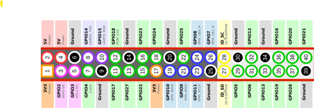
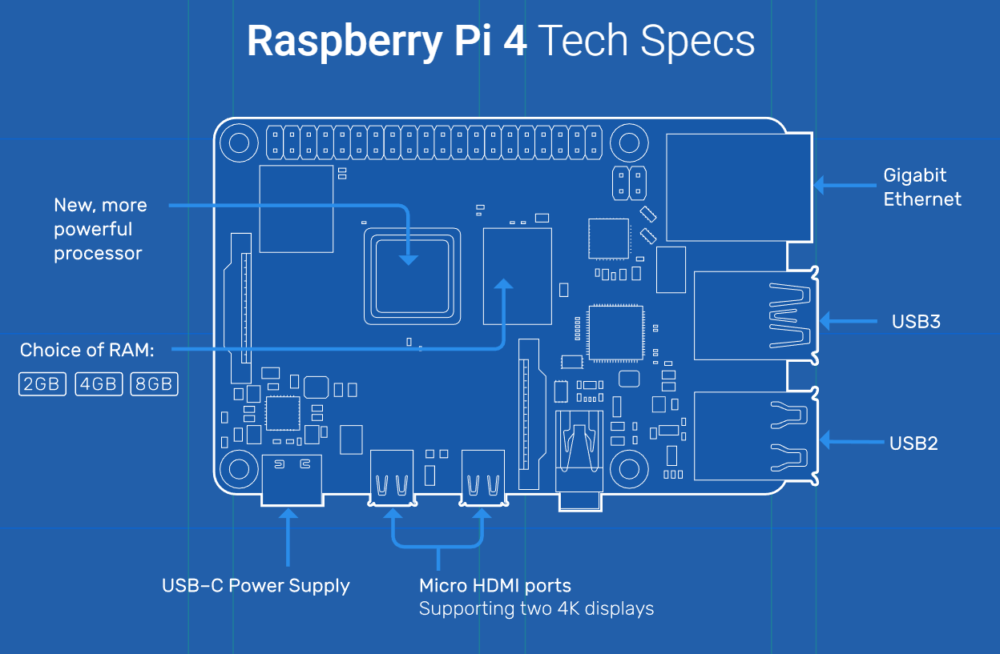

# 🎵 DoorBell Spotify (Billboard Top 10 Smart Doorbell)

A Raspberry Pi powered smart doorbell that:

- Downloads Billboard Hot 100 Top 10 weekly  
- Fetches song previews via Spotify/iTunes  
- Converts previews to WAV using FFmpeg  
- Plays a random 15 second clip when pressed  
- Displays fullscreen messages on HDMI  
- Sends phone/browser push notifications using **ntfy.sh**  
- Auto-starts on boot using systemd  

---

## 🚀 Features

- 🎧 Weekly Billboard Top 10 auto updates  
- 🔔 Physical GPIO button support  
- 🖥 Fullscreen HDMI display UI  
- 📱 Push notifications to phone or browser  
- ⚡ Fast local WAV playback  
- 🔄 Fully automatic boot startup  
- 🧩 Works on Raspberry Pi OS Lite or Desktop  

---

## 🧰 Hardware Requirements

- Raspberry Pi 3 / 4 / 5  
- Push Button (GPIO)  
- HDMI Display  
- Speakers or HDMI Audio  
- Internet Connection  

---

## 📦 Software Requirements

Install system dependencies:

```bash
sudo apt update
sudo apt install ffmpeg python3-pip python3-pygame curl


📥 Clone Repository

git clone https://github.com/joelchicas/DoorBell-Spotify.git
cd DoorBell-Spotify


🐍 Install Python Dependencies

pip3 install -r requirements.txt


🔔 Setup ntfy Notifications
1: Visit:
https://ntfy.sh

2: Choose a topic name
doorbell_home

3: Copy env template:
cp .env.example ~/.env

4: nano ~/.env

5: Change
NTFY_URL=ntfy.sh/doorbell_home


⚡ Install System Services

sudo cp services/*.service /etc/systemd/system/
sudo systemctl daemon-reload

sudo systemctl enable doorbell_cache_updater.service
sudo systemctl enable doorbell_spotify.service

sudo reboot

```

## 🔄 Reboot

After reboot the system will automatically:

- Download Billboard songs weekly
- Start display and button listener
- Play random preview when pressed
- Send push notifications

  ---


## 📱 Phone App Support

ntfy apps is available on: Subscribe to your topic name.

- Apple App Store
- Google Play Store
#### ntfy 

---

## 🔌 GPIO Button Wiring

<p align="center">
  
</p>

<p align="center">
  
</p>

Default GPIO pin:

- GPIO 17

Wiring:

Button one side → GPIO17 = Pin 11

Button other side → GND = Pin 6

#### ⚙ Customization

Change Button GPIO Pin
```
Edit:
doorbell_spotify.py

change:
BUTTON_PIN = 17
```

Change Audio Clip Length

```
Edit:

doorbell_cache_updater.py


Change:

CLIP_LENGTH = 15
```

Change Billboard Update Schedule

```
Edit:

doorbell_cache_updater.py


Change:

DOWNLOAD_WEEKDAY = 4   # Friday
DOWNLOAD_HOUR = 12    # Noon
```

No Audio Output?

```
List audio devices:

aplay -l


Update your service file with correct device:

AUDIODEV=plughw:X,0


Replace X with your card number.

Then reload and restart:

sudo systemctl daemon-reload
sudo systemctl restart doorbell_spotify

```

## 📜 License

MIT License — Free to modify and share.

---


#### ⭐ Credits

Created by Joel Chicas & Sergio Minera


